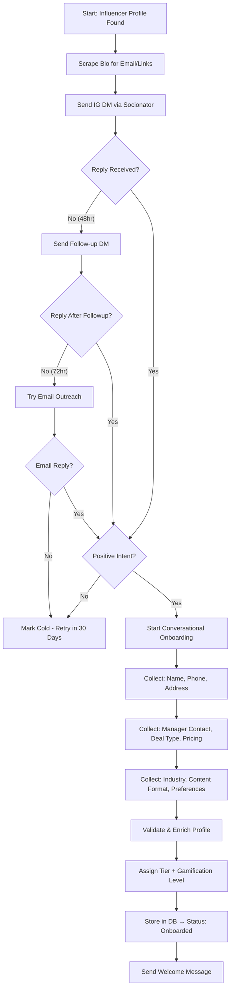
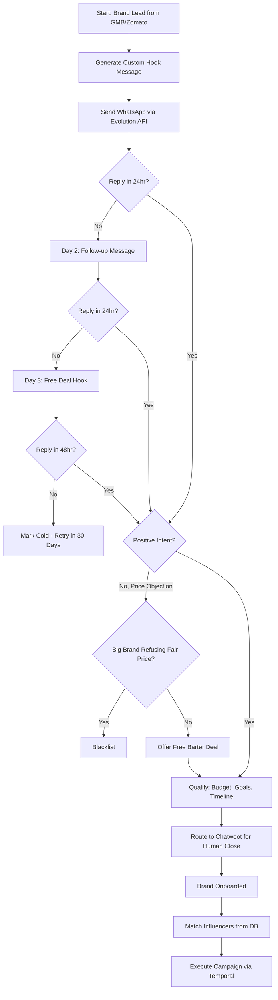

# AI Influencer Agency — Implementation Plan v2.1

> Updated with full operational blueprint. All source material cross-referenced and verified — zero gaps remaining. Covers Phase 1-3 P0s, CRM pipelines, campaign workflows, tooling, and Phase 4 questions.

---

## 1. Two-Agent Architecture (Core)

> [!IMPORTANT]
> Two agents handle everything. Temporal orchestrates long-running workflows. LangGraph handles intelligent decisions within each step. Google Gemini API powers reasoning ($300 GCP credit).

### Agent 1: Influencer Onboarding Agent

**Responsible for:** Finding influencers → sending intro DMs → extracting profile data → conversational onboarding → sorting into database by niche/pricing.

```
Instagram bio scraping (email, links, manager contact)
        ↓
Socionator sends DM sequence (Day 1 → Day 2 → Day 3)
        ↓
Influencer replies → AI starts conversational onboarding
        ↓
Collects: name, phone, address, manager number, deal type, pricing, industry
        ↓
Agent enriches profile (follower count, engagement, niche classification)
        ↓
Categorizes into tier (Nano/Micro/Mid/Macro) + gamification tier
        ↓
Stores in database → status: "onboarded"
```

**LangGraph State Machine:**



**Conversational Onboarding Flow (NOT forms):**

> [!TIP]
> Influencers hate forms. The AI chats naturally on IG DM or WhatsApp. Form only as backup.

Example conversation:

```
🤖 Bot: Hey! Welcome to VibMedia's creator network 🎉
    Quick question — what area are you based in?
👤 Influencer: South Delhi, near Hauz Khas
🤖 Bot: Nice! We get a lot of restaurant deals in HKV.
    What's your usual rate for a reel?
👤 Influencer: Depends, but usually 5K for barter or 8K paid
🤖 Bot: Got it! And you're open to both barter and paid collabs?
👤 Influencer: Yeah, both work
🤖 Bot: Perfect. Last thing — phone number for WhatsApp
    so we can send you deals directly?
👤 Influencer: 98xxxxxx10
🤖 Bot: You're all set! 🚀 We'll start sending you matching
    deals. Here's your creator dashboard link: [link]
```

**Data collected conversationally:**

| Data Point | How Bot Asks | Required |
|---|---|---|
| Full Name | From IG profile (auto-scraped) | ✅ |
| Location / Area | "What area are you based in?" | ✅ |
| Phone (WhatsApp) | "Phone number for WhatsApp deals?" | ✅ |
| Manager Contact | "Do you have a manager we should CC?" | ❌ |
| Deal Type Preference | "Are you open to barter, paid, or both?" | ✅ |
| Rate/Pricing | "What's your usual rate for a reel?" | ✅ |
| Industry/Niche | Auto-classified by AI from content | ✅ |
| Content Formats | "Do you mostly do reels, stories, or YT shorts?" | ❌ |
| Address (for deliveries) | "Address for product shipments if needed?" | ❌ |
| UPI ID (for payments) | "Your UPI for payments when deals close?" | ❌ |

**Fallback:** If influencer says "just send me a form" → send Google Form link with same fields.

**Continuous Enrichment Loop:**
- Agent auto-updates influencer profiles monthly (follower count, engagement, recent posts)
- Detects tier changes (e.g., Micro → Mid) and updates database
- Flags influencers who haven't posted in 30+ days

**Human Escalation — Price Renegotiation:**
- If an influencer raises their rate after onboarding, the AI flags it
- Human agent steps in to negotiate directly
- Updated rate stored in `base_rate` field with `rate_updated_at` timestamp

---

### Agent 2: Deal-to-Booking Agent (Brand Agent)

**Responsible for:** Cold outreach to brands → drip follow-ups → closing the deal → executing the campaign.

**NLP Positive Intent Detection:**
- Agent uses Gemini to classify replies as: positive / neutral / negative / price_objection / spam
- Positive intent triggers: "interested", "tell me more", "how much", "which influencers", "show me"
- Negative intent triggers: "not interested", "stop", "don't message me"
- Price objection triggers: "too expensive", "don't have budget", "free only"

```
Scrape GMB + Zomato for restaurant data
        ↓
Route to WhatsApp outreach via Evolution API
        ↓
Day 1: Send customized hook message
        ↓
Day 2: Follow-up if no reply
        ↓
Day 3: Final follow-up with "free deal" hook
        ↓
Brand replies → Agent qualifies (budget, goals, timeline)
        ↓
Positive → Route to Chatwoot for human close
        ↓
Deal closed → Match influencers → Execute campaign
```

**LangGraph State Machine:**



**Drip Sequence Templates:**

| Day | Message | Purpose |
|---|---|---|
| Day 1 | "Hi {restaurant}! We noticed your {specific_menu_item} on Zomato looks amazing 🔥 We connect restaurants like yours with food creators who make viral reels. Interested in getting featured?" | Custom hook — reference their actual menu/specialty |
| Day 2 | "Hey {name}, just circling back! {nearby_restaurant} in {area} just got 45K views from a creator campaign with us. Would love to help you get similar results." | Social proof from local competitor |
| Day 3 | "Last message! We'd love to offer you a FREE influencer visit — a creator comes, eats, shoots a reel. No cost. Just want to show you how it works. Deal?" | Free-deal hook — barter basis |

---

## 2. Outreach Channels & Tooling

### For Brands: WhatsApp (Evolution API + Chatwoot)

```
┌──────────────────────────────────────┐
│       4-5 WhatsApp Numbers           │
│  (Standard WhatsApp Business App)     │
│                                       │
│  Phone 1 → South Delhi restaurants   │
│  Phone 2 → Gurgaon restaurants       │
│  Phone 3 → Noida restaurants         │
│  Phone 4 → CP/Central Delhi          │
│  Phone 5 → General / overflow        │
├──────────────────────────────────────┤
│    Evolution API (self-hosted)        │
│    Connects all numbers as proxies    │
│    Free messaging (no ₹0.80/msg)     │
├──────────────────────────────────────┤
│    Chatwoot (self-hosted)            │
│    Unified inbox: all conversations  │
│    Human agent monitors & replies    │
│    Tags: lead / interested / closed  │
└──────────────────────────────────────┘
```

**Rate Limiting:** 5-10 messages per number per day → total 20-50 outbound/day across all numbers.

**Why NOT WhatsApp Business API?** ₹0.80/message × 50 msgs/day × 30 days = ₹1,200/month. Evolution API = ₹0/month (just server costs).

### For Influencers: Instagram DMs (Socionator + Proxies)

```
┌──────────────────────────────────────┐
│    Virtual Recruiter Profiles        │
│    "Selena - VibMedia Recruiter" etc │
│    3-5 IG accounts                   │
├──────────────────────────────────────┤
│    Socionator (DM Automation)        │
│    - Day 1: 5 DMs                    │
│    - Day 2: 6 DMs                    │
│    - Day 3: 8 DMs                    │
│    - Follow-ups for non-replies      │
├──────────────────────────────────────┤
│    Bulk Proxies (₹500 / 5 proxies)  │
│    Data center proxies to avoid bans │
└──────────────────────────────────────┘
```

**Fallback if DMs blocked:** Scrape bio → extract email/manager phone → route to email/WhatsApp outreach.

### For Influencers (Backup): Email

- Source: Scraped from IG/YT bios
- Tool: Postal (self-hosted SMTP) or Gmail SMTP initially
- Used only when IG DMs fail

---

## 3. Lead Generation / Scraping

### Brand Leads: GMB + Zomato Scraping

| Source | Data Extracted | Tool |
|---|---|---|
| **Google My Business** | Restaurant name, phone, address, rating, reviews, Google Maps link | Firecrawl / SerpAPI |
| **Zomato** | Restaurant name, phone, cuisine, price range, menu items, photos, rating | Firecrawl / custom scraper |

**Output:** Merged master spreadsheet of 500+ Delhi NCR restaurants with deduplicated data.

**Fields scraped per restaurant:**

| Field | GMB | Zomato |
|---|---|---|
| Name | ✅ | ✅ |
| Phone | ✅ | ✅ |
| Address | ✅ | ✅ |
| Google Maps Link | ✅ | ❌ |
| Cuisine Type | ❌ | ✅ |
| Price Range | ❌ | ✅ |
| Rating | ✅ | ✅ |
| Popular Dishes | ❌ | ✅ |
| Instagram Handle | ❌ | Sometimes |
| Website | ✅ | ✅ |

### Influencer Leads: IG/YT Bio Scraping

| Source | Data Extracted |
|---|---|
| **IG Bio** | Email, external links (Linktree, YouTube), manager contact |
| **IG Profile** | Follower count, post count, engagement rate, recent posts |
| **YouTube** | Subscriber count, video views, channel description |

---

## 4. Influencer Gamification Tiers

> [!TIP]
> **Psychology: Goal-Gradient Effect + IKEA Effect.** Influencers work harder as they approach the next tier. Their investment keeps them loyal.

| Tier | Criteria | Perks | Free Deal Obligation |
|---|---|---|---|
| 🥉 **Bronze** | Newly onboarded | Basic deal access | None |
| 🥈 **Silver** | 3+ completed deals | Priority matching, featured in brand pitches | 1 free barter deal per quarter |
| 🥇 **Gold** | 10+ deals, 4.5+ rating | VIP brand access, higher commission negotiation | 1 free barter deal per month |
| 💎 **Platinum** | 25+ deals, consistently high performance | Exclusive premium brands, negotiation autonomy | 2 free barter deals per month |

**How "Free Deal" hook works for brands:**

```
Brand says "too expensive"
        ↓
Agent offers: "Your first campaign is FREE — just cover the meal cost"
        ↓
Agent matches a Silver/Gold/Platinum tier influencer
who has a "free deal obligation" this month
        ↓
Influencer gets: free meal + content for their page
Brand gets: free reel + proof of concept
Agency gets: foot-in-the-door → brand becomes a paying client
```

---

## 5. CRM Pipelines (Updated)

### Brand Pipeline

| Stage | Trigger | Action |
|---|---|---|
| **Raw Lead** | Scraped from GMB/Zomato | Data stored, not yet contacted |
| **Contacted** | Day 1 WhatsApp sent | Wait for reply |
| **Follow-up 1** | No reply in 24hr | Day 2 message |
| **Follow-up 2** | No reply in 24hr | Day 3: Free deal hook |
| **Interested** | Positive reply | Route to Chatwoot for human |
| **Qualifying** | Human conversation | Budget, goals, timeline |
| **Free Trial** | Accepted free deal | Assign influencer, execute |
| **Onboarded** | First paid campaign | Full client |
| **Active** | Running campaigns | Monitor, report, upsell |
| **Dormant** | 60 days no activity | Re-engage drip |
| **Blacklisted** | Big brand refusing fair price | Never contact again |

### Influencer Pipeline

| Stage | Trigger | Action |
|---|---|---|
| **Discovered** | Found via scraping/search | Profile in DB, not contacted |
| **DM Sent** | Socionator sent Day 1 DM | Wait for reply |
| **Follow-up** | No reply | Day 2/3 follow-ups |
| **Replied** | Any reply received | AI assesses sentiment |
| **Onboarding Chat** | Positive reply | Conversational data collection |
| **Onboarded** | All core data collected | In active pool |
| **Available** | Not on a campaign | Matchable with brands |
| **On Campaign** | Assigned to a deal | Executing deliverables |
| **Completed** | Deal done, content posted | Back to Available |
| **Idle (30d)** | No activity | Send new opportunities |
| **Cold** | Not responding | Retry in 30 days |

---

## 6. Campaign Pipeline — Temporal + LangGraph

### Temporal Workflow (Long-Running)

```
Campaign Created (by human after brand onboarded)
  │
  ├─→ Activity 1: match_influencers (LangGraph Discovery)
  │     Filter by: niche, tier, location, deal type, availability
  │     Output: ranked shortlist of 5-15 influencers
  │     ⏸️ HUMAN GATE: Brand approves shortlist
  │
  ├─→ Activity 2: outreach_to_influencers (LangGraph Outreach)
  │     Send deal offers to approved influencers
  │     Wait for accept/reject/negotiate
  │     ⏸️ HUMAN GATE: Approve deals > ₹50K
  │
  ├─→ Activity 3: coordinate_visit (for local brands)
  │     Schedule visit date with influencer + restaurant
  │     Confirm via WhatsApp
  │     ⏱️ Timeout: 72hr to confirm, else reassign
  │
  ├─→ Activity 4: content_review (LangGraph QC)
  │     Influencer submits draft video
  │     AI checks: hashtags, mentions, duration, tone, brand alignment
  │     ⏸️ HUMAN GATE: Brand reviews after AI pass
  │
  ├─→ Activity 5: posting_confirmation
  │     Track that content was posted on IG/YT
  │     Capture posted URL, initial engagement metrics
  │
  ├─→ Activity 6: payment_settlement
  │     For paid deals: release payment to influencer (UPI/bank)
  │     Deduct 20% commission
  │     For barter: mark as completed
  │
  └─→ Activity 7: generate_report (LangGraph Reporting)
        Compile: reach, impressions, engagement, ROI estimate
        Auto-send to brand via WhatsApp/email
```

### Deal Type Variations

| Step | Barter | Paid | Paid+Barter | Performance |
|---|---|---|---|---|
| Product/Meal | ✅ Influencer keeps | ✅ Influencer returns | ✅ Influencer keeps | Varies |
| Payment | ❌ None | ✅ After approved draft | ✅ After approved draft | ❌ or reduced |
| Ad Spend | ❌ | ❌ | ❌ | ✅ Guaranteed views |
| Commission (20%) | On product value | On payment | On payment | On ad spend total |

---

## 7. Infrastructure — GCP ($300 Credits)

> [!IMPORTANT]
> Changed from Hetzner to **GCP** to leverage $300 free credits. After credits exhaust, evaluate Hetzner for cost optimization.

### GCP Architecture

```
┌─────────────────────────────────────────────┐
│              GCP Compute Engine              │
│                                               │
│  VM 1: Application Server                    │
│  ├── FastAPI (Backend API)                   │
│  ├── LangGraph Agents                        │
│  ├── Temporal Worker                         │
│  └── Celery Workers                          │
│                                               │
│  VM 2: Services                              │
│  ├── Evolution API (WhatsApp × 4-5 numbers) │
│  ├── Chatwoot (unified inbox)                │
│  ├── PostgreSQL                              │
│  ├── Redis                                   │
│  └── Qdrant (vector DB)                     │
│                                               │
│  VM 3: (Later) Next.js Dashboard             │
│  └── Internal + Client dashboards            │
└─────────────────────────────────────────────┘
```

### SSH Server & Proxy Infrastructure

```
VM 2 also manages:
├── SSH access for all proxy accounts
├── Socionator proxy routing (5 data center proxies)
├── IG recruiter account sessions
├── WhatsApp number sessions (Evolution API)
└── Centralized key management (~/.ssh/)
```

**Setup:** SSH keys for each service managed centrally. Proxy rotation configured via crontab or supervisor.

**Cost Estimate (within $300 credit):**

| Resource | Spec | Monthly Cost |
|---|---|---|
| VM 1 (e2-standard-2) | 2 vCPU, 8GB RAM | ~$50/mo |
| VM 2 (e2-standard-2) | 2 vCPU, 8GB RAM | ~$50/mo |
| Cloud SQL (PostgreSQL) | db-f1-micro | ~$10/mo (or self-hosted on VM) |
| Gemini API | Flash + Pro | ~$15-30/mo |
| Proxies (Socionator) | 5 data center | ~₹500/mo (~$6) |
| Storage (30GB SSD each) | | included |
| **Total** | | **~$131/mo → $300 lasts ~2.3 months** |

**After credits:** Migrate to Hetzner (€12-25/mo for same specs) or stay on GCP with minimal plan.

---

## 8. Database Schema (PostgreSQL — Updated)

```sql
-- Influencers with gamification tiers
CREATE TABLE influencers (
    id UUID PRIMARY KEY DEFAULT gen_random_uuid(),
    full_name VARCHAR(255) NOT NULL,
    email VARCHAR(255),
    phone VARCHAR(20),
    manager_phone VARCHAR(20),
    instagram_handle VARCHAR(100) NOT NULL UNIQUE,
    youtube_handle VARCHAR(100),
    linkedin_handle VARCHAR(100),
    platform_primary VARCHAR(20) DEFAULT 'instagram',
    follower_count INTEGER DEFAULT 0,
    engagement_rate DECIMAL(5,2),
    avg_likes INTEGER,
    avg_comments INTEGER,
    avg_views INTEGER,
    bio TEXT,
    content_niche VARCHAR(50)[], -- food, fashion, tech, etc.
    city VARCHAR(100) DEFAULT 'Delhi NCR',
    locality VARCHAR(100),
    full_address TEXT,
    preferred_deal_type VARCHAR(20)[], -- barter, paid, both
    base_rate INTEGER, -- ₹ per reel
    rate_updated_at TIMESTAMPTZ, -- when they last changed their rate
    tier VARCHAR(20), -- nano, micro, mid, macro
    gamification_tier VARCHAR(20) DEFAULT 'bronze', -- bronze, silver, gold, platinum
    quality_score INTEGER, -- 0-100
    total_deals_completed INTEGER DEFAULT 0,
    avg_rating DECIMAL(3,2) DEFAULT 0,
    free_deals_remaining INTEGER DEFAULT 0, -- for Silver+ tiers
    pipeline_status VARCHAR(30) DEFAULT 'discovered',
    upi_id VARCHAR(100),
    tags VARCHAR(50)[],
    notes TEXT,
    source VARCHAR(50), -- ig_scrape, manual, referral
    onboarded_at TIMESTAMPTZ,
    last_enriched_at TIMESTAMPTZ,
    created_at TIMESTAMPTZ DEFAULT NOW(),
    updated_at TIMESTAMPTZ DEFAULT NOW()
);

-- Brands with type distinction (local vs e-commerce — local only for Phase 1-3)
CREATE TABLE brands (
    id UUID PRIMARY KEY DEFAULT gen_random_uuid(),
    restaurant_name VARCHAR(255) NOT NULL,
    contact_person VARCHAR(255),
    phone VARCHAR(20) NOT NULL,
    email VARCHAR(255),
    instagram_handle VARCHAR(100),
    website_url VARCHAR(500),
    brand_type VARCHAR(20) DEFAULT 'local', -- local (restaurants/clinics/gyms), ecommerce, service
    industry VARCHAR(50) DEFAULT 'food', -- food, fashion, tech, beauty, real_estate, etc.
    locality VARCHAR(100),
    full_address TEXT,
    google_maps_link VARCHAR(500),
    zomato_url VARCHAR(500),
    cuisine_type VARCHAR(50)[],
    price_range VARCHAR(10),
    zomato_rating DECIMAL(3,1),
    gmb_rating DECIMAL(3,1),
    popular_dishes TEXT[],
    campaign_goals VARCHAR(100)[],
    preferred_deal_types VARCHAR(50)[],
    budget_range VARCHAR(50),
    wants_website BOOLEAN DEFAULT FALSE,
    wants_ads BOOLEAN DEFAULT FALSE,
    pipeline_status VARCHAR(30) DEFAULT 'raw_lead',
    source VARCHAR(50), -- gmb_scrape, zomato_scrape, referral, ig
    whatsapp_number_used VARCHAR(20), -- which of our 4-5 numbers contacted them
    is_blacklisted BOOLEAN DEFAULT FALSE,
    blacklist_reason TEXT, -- e.g., "Big brand refusing fair price"
    total_spent DECIMAL(12,2) DEFAULT 0,
    notes TEXT,
    onboarded_at TIMESTAMPTZ,
    created_at TIMESTAMPTZ DEFAULT NOW(),
    updated_at TIMESTAMPTZ DEFAULT NOW()
);

-- Campaigns
CREATE TABLE campaigns (
    id UUID PRIMARY KEY DEFAULT gen_random_uuid(),
    brand_id UUID REFERENCES brands(id),
    name VARCHAR(255) NOT NULL,
    deal_type VARCHAR(30) NOT NULL,
    status VARCHAR(30) DEFAULT 'draft',
    budget DECIMAL(12,2),
    brief TEXT,
    content_requirements JSONB,
    target_influencer_count INTEGER,
    target_influencer_tiers VARCHAR(20)[],
    is_free_trial BOOLEAN DEFAULT FALSE, -- free deal hook
    start_date DATE,
    end_date DATE,
    product_details TEXT,
    temporal_workflow_id VARCHAR(255),
    created_at TIMESTAMPTZ DEFAULT NOW(),
    updated_at TIMESTAMPTZ DEFAULT NOW()
);

-- Campaign-Influencer assignments
CREATE TABLE campaign_influencers (
    id UUID PRIMARY KEY DEFAULT gen_random_uuid(),
    campaign_id UUID REFERENCES campaigns(id),
    influencer_id UUID REFERENCES influencers(id),
    status VARCHAR(30) DEFAULT 'shortlisted',
    deal_amount DECIMAL(12,2),
    commission_amount DECIMAL(12,2),
    is_free_deal BOOLEAN DEFAULT FALSE, -- gamification tier obligation
    visit_date DATE,
    visit_confirmed BOOLEAN DEFAULT FALSE,
    content_draft_url VARCHAR(500),
    content_final_url VARCHAR(500),
    posted_url VARCHAR(500),
    reach INTEGER,
    impressions INTEGER,
    engagement INTEGER,
    qc_score INTEGER,
    qc_notes TEXT,
    payment_status VARCHAR(20) DEFAULT 'pending',
    payment_method VARCHAR(20), -- upi, bank_transfer
    paid_at TIMESTAMPTZ,
    created_at TIMESTAMPTZ DEFAULT NOW(),
    updated_at TIMESTAMPTZ DEFAULT NOW(),
    UNIQUE(campaign_id, influencer_id)
);

-- Outreach messages (both channels)
CREATE TABLE outreach_messages (
    id UUID PRIMARY KEY DEFAULT gen_random_uuid(),
    target_type VARCHAR(20), -- influencer, brand
    target_id UUID NOT NULL,
    channel VARCHAR(20), -- whatsapp, ig_dm, email
    direction VARCHAR(10), -- outbound, inbound
    content TEXT,
    status VARCHAR(20) DEFAULT 'queued',
    drip_day INTEGER, -- 1, 2, 3 for drip sequence
    whatsapp_number_from VARCHAR(20), -- which of our numbers sent it
    socionator_profile VARCHAR(100), -- which recruiter profile sent it
    sent_at TIMESTAMPTZ,
    reply_content TEXT,
    replied_at TIMESTAMPTZ,
    created_at TIMESTAMPTZ DEFAULT NOW()
);

-- Agent activity logs
CREATE TABLE agent_logs (
    id UUID PRIMARY KEY DEFAULT gen_random_uuid(),
    agent_name VARCHAR(100), -- influencer_onboarding, deal_to_booking
    action VARCHAR(100),
    input_data JSONB,
    output_data JSONB,
    status VARCHAR(20),
    human_review_required BOOLEAN DEFAULT FALSE,
    execution_time_ms INTEGER,
    llm_model VARCHAR(50),
    llm_tokens_used INTEGER,
    llm_cost_usd DECIMAL(10,6),
    created_at TIMESTAMPTZ DEFAULT NOW()
);

-- Invoices
CREATE TABLE invoices (
    id UUID PRIMARY KEY DEFAULT gen_random_uuid(),
    brand_id UUID REFERENCES brands(id),
    campaign_id UUID REFERENCES campaigns(id),
    amount DECIMAL(12,2),
    service_type VARCHAR(50),
    status VARCHAR(20) DEFAULT 'draft',
    razorpay_payment_id VARCHAR(100),
    paid_at TIMESTAMPTZ,
    created_at TIMESTAMPTZ DEFAULT NOW()
);

-- Influencer payouts
CREATE TABLE influencer_payouts (
    id UUID PRIMARY KEY DEFAULT gen_random_uuid(),
    influencer_id UUID REFERENCES influencers(id),
    campaign_influencer_id UUID REFERENCES campaign_influencers(id),
    gross_amount DECIMAL(12,2),
    commission_deducted DECIMAL(12,2),
    net_amount DECIMAL(12,2),
    status VARCHAR(20) DEFAULT 'pending',
    payment_method VARCHAR(20), -- upi, bank_transfer
    paid_at TIMESTAMPTZ,
    created_at TIMESTAMPTZ DEFAULT NOW()
);
```

---

## 9. Tech Stack Summary (Final)

| Layer | Tool | Why |
|---|---|---|
| **AI Agents** | LangGraph (Python) | Stateful graphs, human-in-the-loop gates |
| **LLM** | Google Gemini 2.0 Flash/Pro | $300 free credit, fast, cheap |
| **LLM (backup)** | Llama 3 70B via Ollama | Free after credits exhaust |
| **Backend** | FastAPI + Celery | Python-native, async, background jobs |
| **Frontend** | Next.js 15 (TypeScript) | Internal dashboard → client portal |
| **Database** | PostgreSQL 16 | Relational campaign data, JSONB flexibility |
| **Vector DB** | Qdrant (self-hosted) | Semantic influencer search |
| **Workflow** | Temporal (self-hosted) | Campaign lifecycle (days/weeks) |
| **WhatsApp** | Evolution API (self-hosted) | Free messaging, multi-number |
| **WhatsApp UI** | Chatwoot (self-hosted) | Unified inbox for all numbers |
| **IG DMs** | Socionator + proxies | Automated DM sequences |
| **IG Proxies** | Bulk data center (₹500/5) | Avoid bans |
| **Scraping** | Firecrawl / custom | GMB, Zomato, IG bio extraction |
| **WordPress** | Existing MCP setup | Upsell single-page sites |
| **Payments** | UPI (Phase 1) → Razorpay (Phase 3+) | Start free, formalize later |
| **Hosting** | GCP ($300 credit) → Hetzner (post-credit) | Free start, cheap scale |
| **CRM (Phase 1)** | Google Sheets | Zero cost, migrate to DB in Phase 2 |

---

## 10. Strategic Questions for Phase 4

> Answer using data collected during Phase 1-3 operations.

### Architecture (Q1-Q3)

1. **Tenant Isolation:** Shared DB with row-level security, or separate DBs per agency client?
2. **API-First vs UI-First:** Public API for technical agencies, or full white-label dashboard?
3. **Agent Customization:** Should clients customize agent behavior (tone, scoring weights, QC rules)?

### Business Model (Q4-Q6)

4. **SaaS Pricing:** By Phase 3 end, which features do clients value most? (Use analytics.)
5. **Agency vs SaaS Revenue:** At what point shift focus from agency to SaaS?
6. **Geographic Expansion:** Which cities next? What localization needed?

### Product (Q7-Q9)

7. **Self-Serve Campaign Builder:** How much can brands do themselves?
8. **Influencer Self-Service Portal:** Should influencers browse and apply to campaigns?
9. **Mobile App vs Web:** Do influencers need a native app?

### Data & Trust (Q10-Q14)

10. **Recommender System:** ML-based matching vs rule-based scoring?
11. **Competitive Intelligence:** Should platform show competitor campaigns?
12. **Brand Safety SLA:** Manual review, AI-only, or hybrid?
13. **Dispute Resolution:** How to arbitrate brand-influencer disagreements?
14. **Agent Cost at Scale:** At 100 campaigns, should we go 100% self-hosted LLM?
