# 🏗️ System Architecture — Kobi AI Influencer Agency

> Complete architecture design for Phase 1 with all subsystem diagrams. Comprehensive mermaid-diagrammed version covering all agents, pipelines, infrastructure, and data flows.

> **WhatsApp Model:** Hybrid — AI sends personalized first touch, human handles complex replies via Chatwoot.

---

## 1. High-Level System Architecture

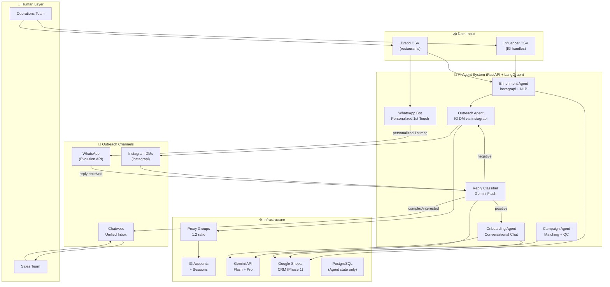

---

## 2. Influencer Pipeline Flow

```mermaid
flowchart LR
    subgraph IMPORT["1️⃣ Import"]
        A[CSV/Sheets Import] --> B[Dedup by Handle]
        B --> C[Validation]
    end

    subgraph ENRICH["2️⃣ Enrichment"]
        C --> D[instagrapi user_info]
        D --> E[Engagement Rate Calc]
        E --> F[Niche Classification]
        F --> G[Quality Score 0-100]
        G --> H[Tier Assignment]
    end

    subgraph OUTREACH["3️⃣ Outreach"]
        H --> I[DM Day 1: Intro]
        I -->|no reply| J[DM Day 3: Follow-up]
        J -->|no reply| K[DM Day 5: Final]
    end

    subgraph CLASSIFY["4️⃣ Classification"]
        I -->|reply| L{Reply Classifier}
        J -->|reply| L
        K -->|reply| L
        L -->|positive| M[Onboarding Agent]
        L -->|negative| N[Stop + Mark Cold]
        L -->|question| O[AI Answers]
        L -->|spam| P[Ignore]
    end

    subgraph ONBOARD["5️⃣ Onboarding"]
        M --> Q[Collect: Name, Area]
        Q --> R[Collect: Phone, Rate]
        R --> S[Collect: Deal Pref]
        S --> T[Validate All Fields]
        T --> U[Profile Complete<br/>0 pts, Bronze]
    end

    style IMPORT fill:#1a1a2e,color:#fff
    style ENRICH fill:#16213e,color:#fff
    style OUTREACH fill:#0f3460,color:#fff
    style CLASSIFY fill:#533483,color:#fff
    style ONBOARD fill:#2a4858,color:#fff
```

---

## 3. Brand Pipeline Flow (Hybrid WhatsApp)

> **Key Change:** AI sends the personalized first touch. Human takes over after first meaningful reply.

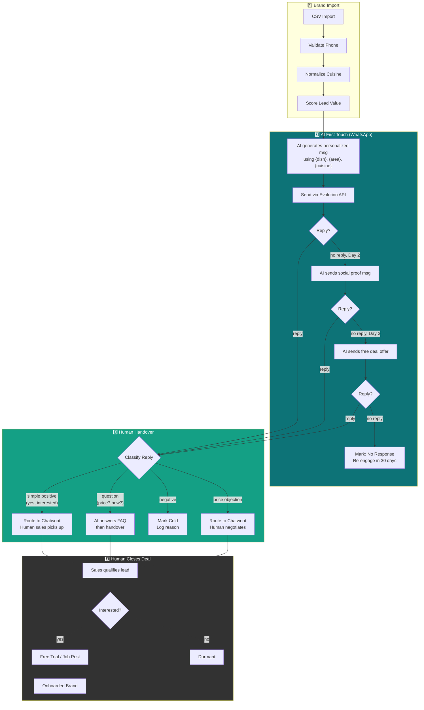

---

## 4. Job Board & Points System

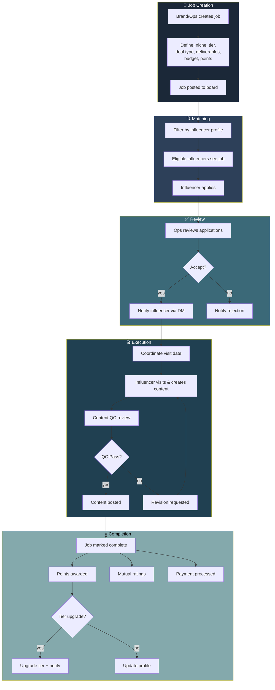

---

## 5. Points & Reputation Tiers

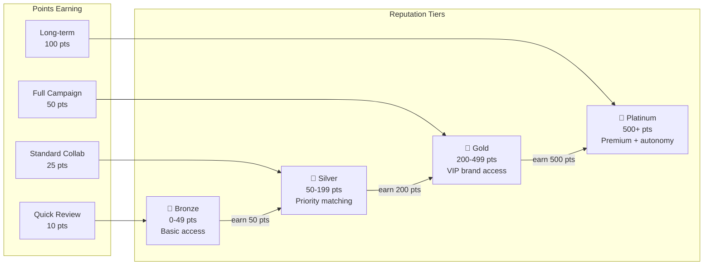

---

## 6. AI Agent Architecture (LangGraph)

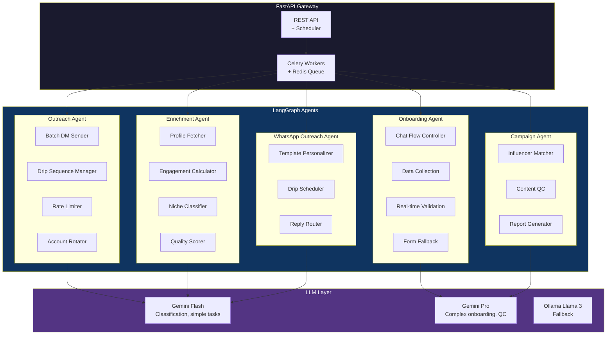

---

## 7. Infrastructure Deployment (Phase 1 — GCP)

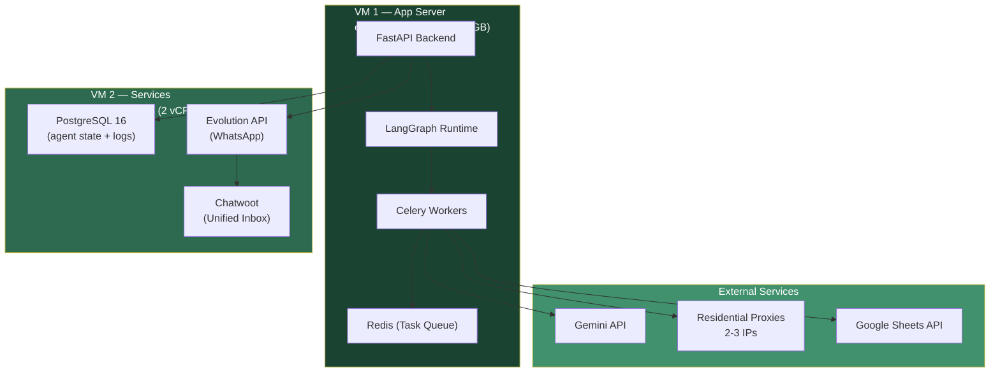

---

## 8. Proxy & Account Architecture

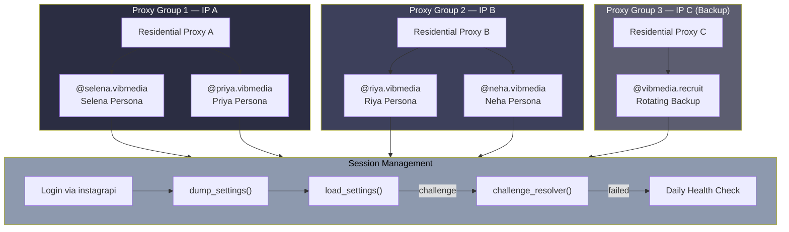

---

## 9. Data Layer (Phase 1 → Phase 2 Migration)

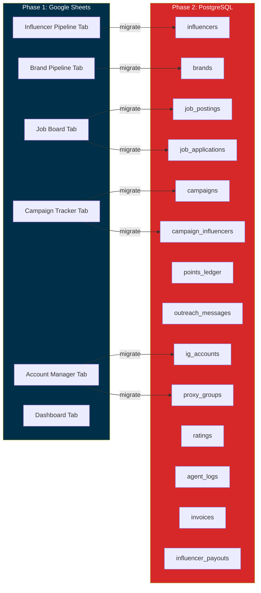

---

## 10. WhatsApp Hybrid Outreach Detail

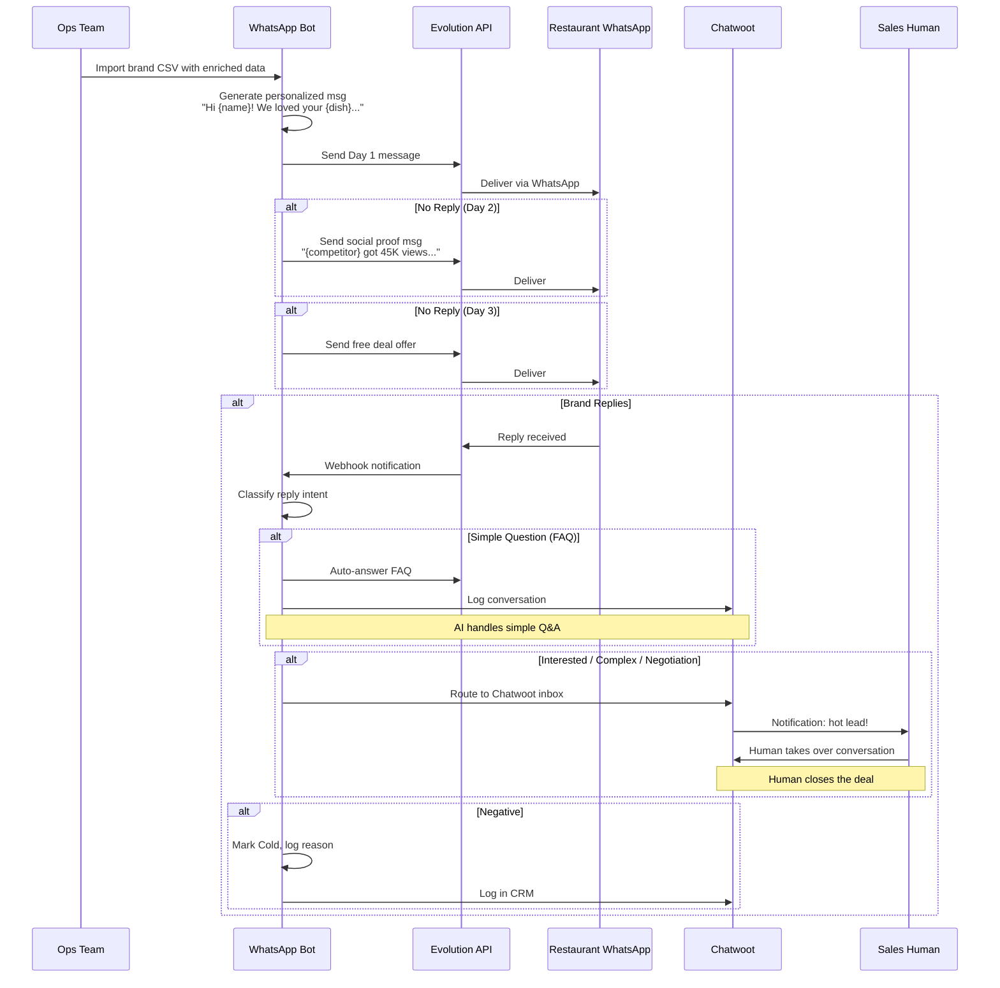

---

## 11. Reply Classification System

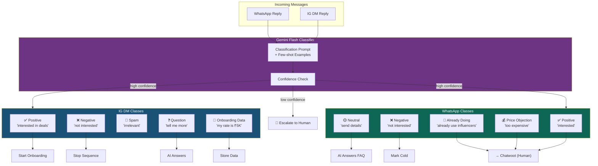

---

## 12. Campaign Lifecycle

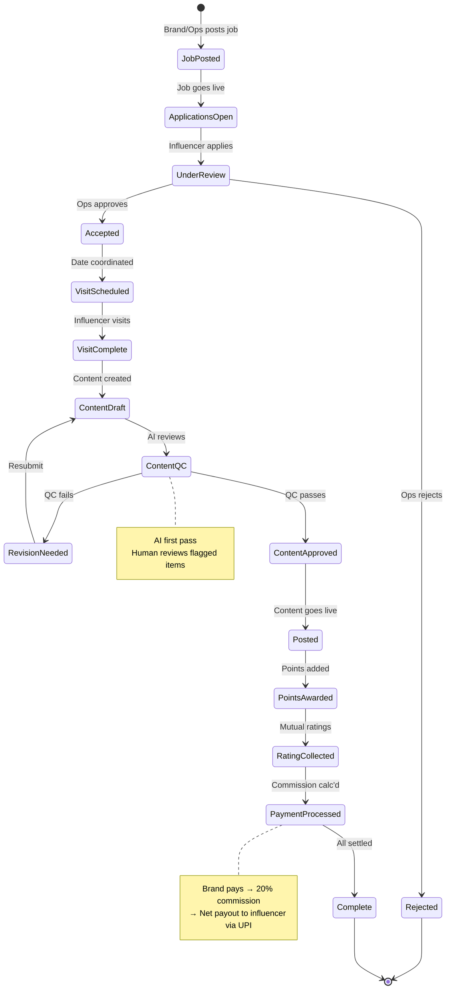

---

## 13. CRM Pipeline State Machines

### Influencer Pipeline
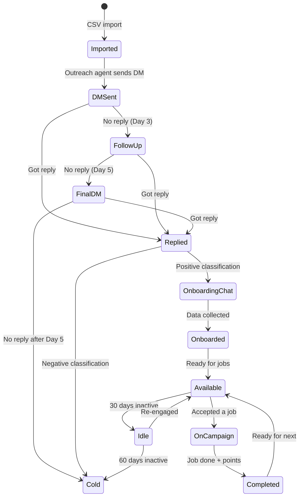

### Brand Pipeline
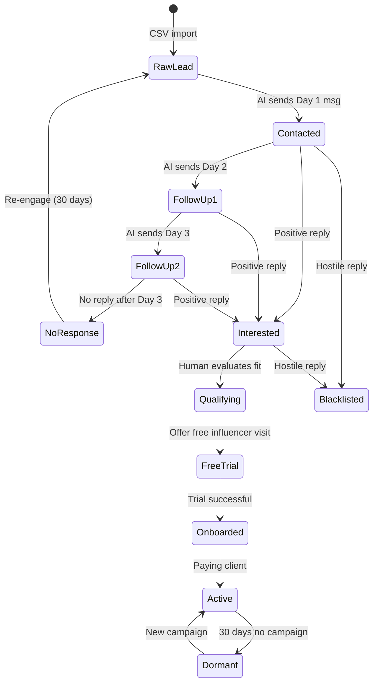

---

## 14. Reporting & Notification Flow

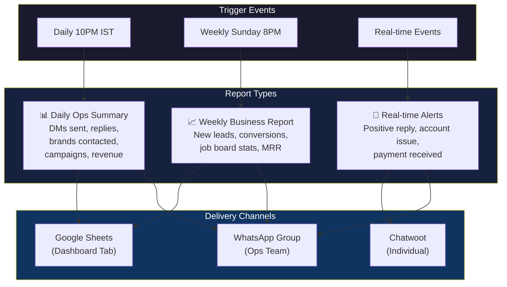

---

## External Service Dependencies

| Service | Purpose | Phase 1 Status | Failure Impact |
|---------|---------|----------------|----------------|
| **instagrapi** | IG DM sending + profile enrichment | Primary tool | ⚠️ Critical — outreach stops |
| **Gemini API** | LLM for reply classification, onboarding chat | Primary LLM | ⚠️ High — agents degrade |
| **Evolution API** | WhatsApp message sending (AI + manual) | Primary tool | 🟡 Medium — switch to personal WA |
| **Chatwoot** | Unified inbox for brand replies + human handover | Required | ⚠️ High — lose handover flow |
| **Google Sheets API** | CRM data read/write | Data layer | ⚠️ High — use offline sheets |
| **Proxy provider** | IP addresses for IG accounts | Infrastructure | ⚠️ High — accounts at risk |
